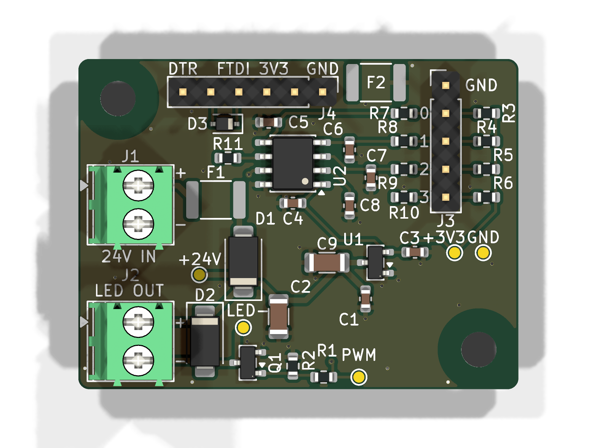

# led-pwm-4bit

A 40 × 30 mm two-layer board that dims a 24 V LED strip to one of 16 levels set by
four open-drain outputs of a Prusa GPIO Hackerboard. An ATtiny412 reads the 4-bit
word and drives a low-side N-MOSFET with 10-bit PWM at about 2.4 kHz.

KiCad 10 project. The design brief is [docs/spec.md](docs/spec.md) and the
reference netlist is [docs/netlist.txt](docs/netlist.txt).



## Status

| Step | State |
|---|---|
| Schematic | Done. ERC: 0 violations. `check_netlist.py`: matches `docs/netlist.txt` |
| Placement | Done. Schematic parity clean |
| Routing | In progress. DRC: 0 violations; 5 unrouted connections (three `HB_GND` links to F2, UPDI_BUS R11–D3, SEL3 C8–R10). GND pours stitched with 32 vias |
| Parts | Every line has a manufacturer part carried by Mouser; see [Parts](#parts) |
| Firmware | Not started (spec section 9) |

## Files

| Path | Contents |
|---|---|
| `led-pwm-4bit.kicad_pro` | Project: JLCPCB constraints, net classes (Default, Power) |
| `led-pwm-4bit.kicad_sch` | Schematic, one sheet, KiCad standard symbols only |
| `led-pwm-4bit.kicad_pcb` | Board |
| `led-pwm-4bit.kicad_dru` | Custom DRC rules (JLCPCB limits, 0.5 mm power tracks) |
| `check_netlist.py` | Compares the schematic netlist with `docs/netlist.txt` |
| `scripts/export-fab.sh` | Runs ERC, netlist check and DRC, then writes `fab/` |
| `fab/` | Schematic PDF, BOM, Mouser order CSV, position file, renders; Gerbers once DRC is clean |

## Parts

All parts are chosen from manufacturers Mouser stocks, and each was checked against
its manufacturer's datasheet for package, pinout and ratings. Capacitor values were
also checked against DC-bias data.
`fab/led-pwm-4bit-bom.csv` is the full BOM and `fab/led-pwm-4bit-mouser-order.csv`
is in Mouser's BOM-tool format (`BOARDS=n scripts/export-fab.sh` scales it). The
order rounds the resistors, capacitors and D3 up to at least 10 with spares, which
costs less than the exact count at Mouser's single-piece prices.

The Mouser part-number column is left empty on purpose. Mouser blocks automated
access, so no Mouser number could be read off its live listing, and a guessed
number can import cleanly and still be the wrong part. Mouser's BOM tool matches
each line on the manufacturer part number instead. Once a Mouser number is
confirmed, add a field named `Mouser` to that symbol and the export carries it.

| Ref | Part | Notes |
|---|---|---|
| U1 | Microchip MCP1792T-3302H/CB | 55 V input LDO, SOT-23A |
| U2 | Microchip ATTINY412-SSN | Tube; ATtiny212-SSN also fits |
| Q1 | ROHM RTR030N05HZGTL | 45 V, RDS(on) ≤ 95 mΩ at VGS 2.5 V. The 60 V IRLML0060 is not rated below 4.5 V gate drive |
| D1, D2 | Diodes Inc B160-13-F | 60 V 1 A Schottky, SMA |
| D3 | onsemi BAT54HT1G | SOD-323, pin 1 cathode (BAT54J is out of stock at Mouser) |
| F1 | Littelfuse 1812L050/60MR | 0.5 A hold, 60 V, Imax 10 A |
| F2 | Bel Fuse 0ZCG0010FF2C | 0.1 A hold, 60 V, Imax 100 A; Hackerboard/programmer ground return |
| C1 | Murata GRM188R61H225KE11D | 2.2 µF 50 V X5R 0603, about 0.4 µF at 24 V |
| C2, C9 | Murata GRM31CR71H475MA12L | 4.7 µF 50 V X7R 1206, about 2.7 µF each at 24 V |
| C3 | Samsung CL10A106MP8NQWC | 10 µF 10 V X5R 0603, about 5.9 µF at 3.3 V |
| C4 | KEMET C0603C104K5RACTU | 100 nF 50 V X7R |
| C5–C8 | KEMET C0603C103K5RACTU | 10 nF 50 V X7R |
| R1–R11 | YAGEO RC0603FR-07…L | 1 % 0603; R3–R10 are all 10 kΩ |
| J1, J2 | Phoenix Contact 1984617 | PT 1,5/2-3,5-H, the part the footprint is drawn for |
| J3 | Würth 61300511121 | 1×5 2.54 mm header |
| J4 | Würth 61300611121 | 1×6 2.54 mm header |

No 10 µF 50 V X7R in 1206 was in stock at Mouser. The Murata 4.7 µF X7R keeps more
capacitance at 24 V than any 10 µF 1206 part Mouser stocks.

## Routing notes

- The Power net class (`+24V_IN`, `VIN_F`, `+24V`, `LED_NEG`, `GND`) defaults to
  0.5 mm, and DRC rejects anything narrower. Signals default to 0.25 mm.
- Rule areas keep tracks off B.Cu under Q1 and U2, so the bottom pour stays whole
  there (spec section 8). Ground vias are still allowed.
- Return Q1's source (pin 2) straight to the GND pad of C2.
- The pours are stitched with 32 GND vias (0.6/0.3 mm, tented): one beside each
  GND pad, two between C9 and U1, plus a sparse 8 mm grid. The +24V and +3V3
  tracks split the top pour into regions joined only by thin necks, and the vias
  tie every region to the bottom pour. The vias stay clear of the routes still to
  be drawn and of the mounting-hole keepout, and no via drill lands on
  silkscreen. A few via rings reach under the edge of a part outline; they are
  tented, so this is cosmetic.
- C6 pad 2 had only one thermal spoke because SEL1 and SEL2 crowd it. It now has a
  0.5 mm GND track to a via at (125.75, 108.75).
- `HB_GND` joins J3 pin 1, J4 pins 1–2 and F2 pad 1. A 0.25 mm track is enough,
  and it survives the brief fault current before F2 trips. J3.1 to J4.1 runs easily
  on B.Cu. Keep it out of the GND pour: F2 is the only connection between the two
  grounds.
- `scripts/export-fab.sh` refills the pours before its DRC, without saving the board.

## Wiring and mounting

- Fuse the 24 V feed at the source: a 2–3 A fast fuse (rated ≥ 32 V DC) in the +
  lead at the PSU or tap point, or a separate 1–2 A supply. F1 is rated to interrupt
  only 10 A and does not protect the J1 cable.
- Run the supply's − wire straight to J1 pin 2. Don't share it with the Hackerboard
  cable's ground, so only signal current flows through the Hackerboard ground.
- Check the strip wiring for a short between + and − before the first power-up.
- Mount the board on standoffs with nylon screws, or keep metal hardware away from any
  grounded frame. The mounting holes have no copper around them.
- Avoid hot-plugging J1 at 28 V with long leads (see Open items).

## Connectors

| | Pin 1 | Pin 2 | Pin 3 | Pin 4 | Pin 5 | Pin 6 |
|---|---|---|---|---|---|---|
| J1 24 V in | +24 V | GND | | | | |
| J2 LED strip | Strip + | Strip − | | | | |
| J3 Hackerboard J6 pins 1–5 | GND (via F2) | out0 | out1 | out2 | out3 | |
| J4 FTDI adapter | GND (via F2) | CTS (GND via F2) | VCC (n.c.) | TXD | RXD / UPDI | DTR (n.c.) |

Hackerboard J6 is a 1×10 2.54 mm footprint, usually bare holes. Its pin 1 is the
square pad by the `GND` label at the `0` end. A straight 1×5 cable from J6 pins 1–5
to J3 matches pin for pin.

## Flashing

J4 takes any USB-serial adapter in the standard FTDI pin order with **3.3 V logic**
(FT232R, CP2102, or a CH340 that really runs at 3.3 V). The SerialUPDI network
(D3 and R11) is on the board, so the adapter needs no modification.

1. Power the board from 24 V. J4's VCC pin is not connected.
2. Plug the adapter in with its GND on J4 pin 1 (the `GND` end of the header).
3. Flash with avrdude 8.x:

   ```bash
   avrdude -c serialupdi -p t412 -P /dev/cu.usbserial-XXXX -U flash:w:firmware.hex:i
   ```

   or pymcuprog:

   ```bash
   pymcuprog write -t uart -u /dev/cu.usbserial-XXXX -d attiny412 -f firmware.hex --erase --verify
   ```

Keep the default 115200 baud at 3.3 V. In the Arduino IDE with megaTinyCore, pick
"SerialUPDI - SLOW: 57600 baud", a 10 MHz clock and BOD 2.6 V. Never change the
UPDI/reset pin fuse: recovery would then need a 12 V programmer.

A Microchip programmer (Atmel-ICE, MPLAB SNAP, PICkit) connects to J4 pin 5 (UPDI)
and pin 1 (GND), with its target-voltage sense lead on TP2 (+3V3) and the board
powered from 24 V. Leave "power target from tool" off.

## Using it from the printer

```gcode
M267 R3 B0    ; once: all expander pins are outputs (firmware default)
M267 R1 B15   ; level 15 (full on); B0 = off, B1..B14 in between
```

The level persists in the printer's EEPROM. While the printer boots, or when the
cable is unplugged, the inputs float high and the strip is off.

## Checks

```bash
python3 check_netlist.py
```

```bash
scripts/export-fab.sh
```

The script runs ERC (`--severity-all --exit-code-violations`), the netlist check and
DRC with `--schematic-parity` after refilling the pours. It writes Gerbers and
separate plated and non-plated drill files only when DRC reports no violations and
no unrouted connections.

## Changes from spec Rev 0.1

- Resistors and small capacitors are 0603. The 47 µF electrolytic is replaced by two
  4.7 µF 50 V X7R 1206 MLCCs (C2, C9), because no 50 V bulk part exists in 0603.
- J4 is a 6-pin FTDI-style header with a SerialUPDI network (D3, R11 470 Ω)
  instead of a bare 3-pin UPDI header.
- SEL pins are permuted for a crossing-free layout: SEL0 = PA2, SEL1 = PA1,
  SEL2 = PA7, SEL3 = PA6. Section 6 of the spec allows this.
- Q1 is a ROHM RTR030N05HZGTL (45 V) instead of the AO3422 (55 V), which Mouser
  does not carry.
- F2 puts the Hackerboard and programmer grounds (net `HB_GND`) behind a 0.1 A PPTC,
  and R7–R10 are 10 kΩ instead of 1 kΩ.
- Board constraints follow JLCPCB's 2-layer 1 oz capabilities. The design net
  classes keep the spec's 0.2 mm clearance and 0.25 / 0.5 mm tracks.

## Open items

- **Reverse polarity with a shared ground.** D1 protects only the board's own +24V
  rail. If the supply shares ground with the printer and the J1 wires are swapped,
  board GND rises to supply +. F2 then trips and stops the short through the
  Hackerboard ground, and the 10 kΩ R7–R10 keep the current into the input pins to
  about 2.4 mA each. Two exposures remain:
  - The pull-ups R3–R6 draw up to about 11 mA out of +3V3, pulling it about 0.6 V
    below GND. That is past the U1 and U2 supply-pin limits. A Schottky clamp from GND
    to +3V3 would fix it.
  - A programming adapter plugged in at the same time sees 41–57 mA through R11, which
    burns R11 (0.8–1.5 W) and stresses U2's UPDI pin and the adapter. Check J1
    polarity before plugging in an adapter.
  A reverse-polarity MOSFET in the J1 return would remove both by keeping board GND
  from rising at all.
- **Strip short.** F1 protects the wiring and D1, not Q1. A short across J2 while the
  strip is lit can destroy Q1 (3 A continuous, 12 A for 10 µs). A failed Q1 usually
  shorts and leaves the strip on. Replace Q1 after any strip short.
- **Hot-plug overshoot.** The all-ceramic 24 V input rings when J1 is hot-plugged, and
  D1 holds the peak on +24V. At 24 V with leads of 2 m or less the first peak is about
  30–36 V. At 28 V with heavy leads and F1 near its minimum resistance it can reach
  45–50 V, above Q1's 45 V and the capacitors' 50 V rating. A 47 µF 50 V electrolytic
  on +24V would damp it to under 30 V.
- Prusa lists the Core One INDX as *not compatible* with the GPIO Hackerboard, although
  firmware 6.9.1 and 6.10.1 still enable the M262–M268 commands on it.
- JLCPCB charges a small-board fee when a side is 30 mm or less. 40 × 31 mm avoids it.
